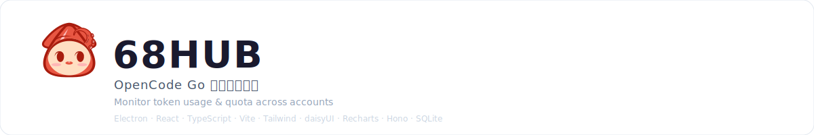
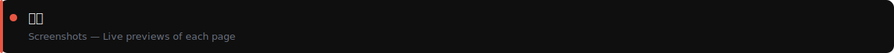
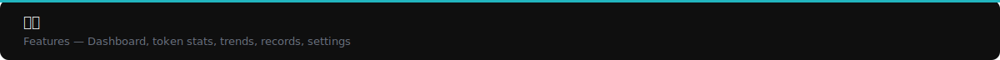
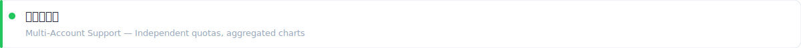
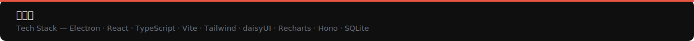
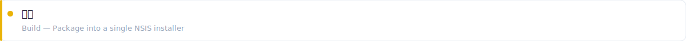
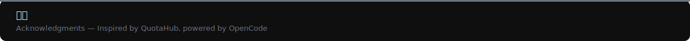
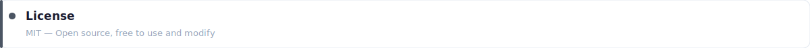

<p align="center">
  
</p>

<p align="center">
  <a href="./README.md"></a>
</p>

---

<p align="center">
  
</p>

| Page | Preview |
|------|---------|
| 📊 **Usage Dashboard** |  |
| 📈 **Token Stats** |  |
| 📅 **Daily Trends** |  |
| ⚙️ **Settings** |  |

<p align="center">
  
</p>

| Module | Description |
|--------|-------------|
| 📊 **Dashboard** | Account count, remaining quota, total token consumption at a glance; quota progress bars (5h/7d/30d) on the left, Top 3 model Input/Output donut chart on the right |
| 📈 **Token Stats** | Model token consumption ranking (stacked bar chart) + daily trends per model (multi-series line chart), filterable by account and time range |
| 📅 **Daily Trends** | Daily cost and request volume line charts, filterable by account and time range |
| 📋 **Usage Records** | Complete usage record log with pagination and account filtering |
| ⚙️ **Settings** | Multi-account management (add/test/sync/backfill/delete), auto-sync toggle and interval setting |
| ℹ️ **About** | Contact info and tech stack |

<p align="center">
  
</p>

```bash
# Install dependencies
pnpm install

# Run in dev mode (auto-starts backend + Vite + Electron)
pnpm dev

# Start Vite frontend only (requires backend or mock)
pnpm dev:vite
```

> The embedded backend starts automatically with the Electron main process (Hono + better-sqlite3), no need to start a separate Python service.

<p align="center">
  
</p>

- **Quota**: Each account independently displays 5h/7d/30d progress bars
- **Charts**: All account data aggregated, filterable by account
- **Control**: Each account can be individually enabled/disabled

<p align="center">
  
</p>

| Frontend | Backend | Tools |
|----------|---------|-------|
| Electron 31 | Hono + better-sqlite3 | electron-builder |
| React 18 | TypeScript | Windows x64 |
| Vite 5 + Tailwind 4 | zod | |
| daisyUI 5 + Recharts | fetch (Node) | |

<p align="center">
  
</p>

```
68HUB/
├── electron/
│   ├── main.ts            # Electron main process + embedded backend startup
│   ├── preload.ts         # IPC bridge
│   └── backend/           # Node backend (Hono + better-sqlite3)
│       ├── server.ts      # HTTP server lifecycle + auto-sync
│       ├── routes.ts      # All API routes
│       ├── db.ts          # SQLite CRUD
│       ├── config.ts      # Config/masking
│       ├── quota.ts       # OpenCode quota fetcher
│       ├── ollama-quota.ts # Ollama quota fetcher
│       ├── opencode-usage.ts # Usage record fetcher
│       ├── usage-sync.ts  # Incremental/backfill sync
│       ├── analytics.ts   # Dashboard aggregation
│       └── ...
├── src/                   # React frontend (api / components / pages / hooks)
├── public/                # Static assets
└── build/                 # Icons (auto-generated)
```

<p align="center">
  
</p>

```bash
pnpm dist
```

Output: `release\68HUB Setup 1.1.1.exe`

<p align="center">
  
</p>

- [QuotaHub](https://github.com/lvmiao233/QuotaHub) — Backend architecture inspiration
- [OpenCode](https://opencode.ai) — API provider

<p align="center">
  
</p>

- Email: 1771005798@qq.com
- Telegram: [@Z6ix8ightBot](https://t.me/Z6ix8ightBot)
- Website: [www.110.wtf](https://www.110.wtf)

<p align="center">
  
</p>
