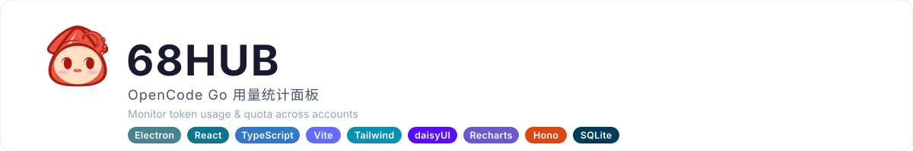
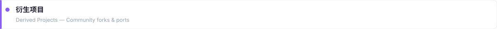
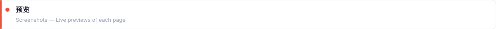
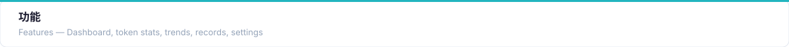
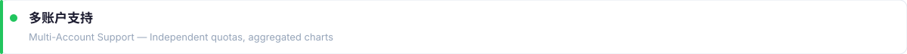
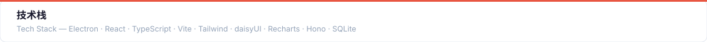
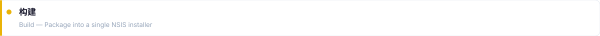
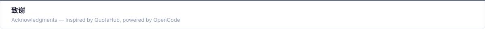
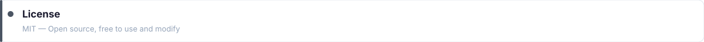

<p align="center">
  
</p>

<p align="center">
  <a href="./README.md">🌐 中文</a>
</p>

<p align="center">
  
  
  
  
</p>

**68HUB** is an Electron-based dashboard for OpenCode Go usage: multi-account quotas, token consumption, daily trends and usage records at a glance — all data stays on your machine.

---

<p align="center">
  
</p>

Community projects forked from 68HUB (ordered by creation date):

| Project | Platform | Highlights |
|---------|----------|------------|
| [68HUB Web Server Edition](https://github.com/1chenmm/opencode-go-usage) | 🌐 Web | Electron-free web deployment, Hono + better-sqlite3 backend, Docker / systemd one-click deploy, browser access |
| [OCGoQuota](https://github.com/h6161236-spec/OCGoQuota) | 📱 Android | Tauri 2 + Rust local core, encrypted cookie storage, pull-to-refresh, no cloud dependency |
| [OpenCodeQME](https://github.com/MOSSVENC/OpenCodeQME) | 🧩 Chrome / Edge | Standalone MV3 browser extension, toolbar popup + full detail page, IndexedDB local history, bilingual UI |
| [OpenCodeBoard](https://github.com/KDB-Wind/opencodeboard) | 🖥️ Windows | Personal-use branch, upgraded to Electron 43, model filtering in token stats, independent releases |
| [68HUB Android](https://github.com/moondrop12138/opencode-plan-manager) | 📱 Android | React Native + Expo port, UI and features aligned with the desktop app, auth cookie encrypted via KeyStore |

Thanks to every contributor who forked and improved this project. Feel free to build your own under the MIT license.

---

<p align="center">
  
</p>

| Page | Preview |
|------|---------|
| 📊 **Dashboard** |  |
| 📈 **Token Stats** |  |
| 📅 **Daily Trends** |  |
| ⚙️ **Settings** |  |

<p align="center">
  
</p>

| Module | Description |
|--------|-------------|
| 📊 **Dashboard** | Account count, remaining quota, total and today's token consumption at a glance; quota progress bars (5h/7d/30d) on the left, Top 3 model Input/Output donut chart with period switching on the right |
| 📈 **Token Stats** | Log-scale model token consumption chart and usage trends with adaptive input/output bar spacing; filterable by account and time range, defaulting to the last 30 days with the selection persisted |
| 📅 **Daily Trends** | Browse daily input, output, cache tokens and cache rate by model, with account filtering |
| 📋 **Usage Records** | Complete usage record log with pagination and account filtering |
| ⚙️ **Settings** | Multi-account management (add/test/sync/backfill/delete), auto-sync toggle and interval setting; automatically switches to an available backend port when needed |
| ℹ️ **About** | Contact info and tech stack |

<p align="center">
  
</p>

- **Quota**: Each account independently displays 5h/7d/30d progress bars
- **Charts**: All account data aggregated, filterable by account
- **Control**: Each account can be individually enabled/disabled

<p align="center">
  
</p>

```bash
# Install dependencies
pnpm install

# Run in dev mode (auto-starts backend + Vite + Electron)
pnpm dev

# Start Vite frontend only (requires backend or mock)
pnpm dev:vite
```

> The embedded backend starts automatically with the Electron main process (Hono + better-sqlite3), no need to start a separate Python service.

<p align="center">
  
</p>

| Frontend | Backend | Tools |
|----------|---------|-------|
| Electron 31 | Hono + better-sqlite3 | electron-builder |
| React 18 | TypeScript | Windows · macOS |
| Vite 5 + Tailwind 4 | zod | |
| daisyUI 5 + Recharts | fetch (Node) | |

<p align="center">
  
</p>

```
68HUB/
├── electron/
│   ├── main.ts            # Electron main process + embedded backend startup
│   ├── preload.ts         # IPC bridge
│   └── backend/           # Node backend (Hono + better-sqlite3)
│       ├── server.ts      # HTTP server lifecycle + auto-sync
│       ├── routes.ts      # All API routes
│       ├── db.ts          # SQLite CRUD
│       ├── config.ts      # Config/masking
│       ├── quota.ts       # OpenCode quota fetcher
│       ├── ollama-quota.ts # Ollama quota fetcher
│       ├── opencode-usage.ts # Usage record fetcher
│       ├── usage-sync.ts  # Incremental/backfill sync
│       ├── analytics.ts   # Dashboard aggregation
│       └── ...
├── src/                   # React frontend (api / components / pages / hooks)
├── public/                # Static assets
└── build/                 # Icons (auto-generated)
```

<p align="center">
  
</p>

```bash
pnpm dist
```

Output: `release\68HUB Setup <version>.exe`

<p align="center">
  
</p>

- [QuotaHub](https://github.com/lvmiao233/QuotaHub) — Backend architecture inspiration
- [OpenCode](https://opencode.ai) — API provider

<p align="center">
  
</p>

- Email: 1771005798@qq.com
- Telegram: [@Z6ix8ightBot](https://t.me/Z6ix8ightBot)
- Website: [www.110.wtf](https://www.110.wtf)

<p align="center">
  
</p>

[MIT](LICENSE) © 68HUB
